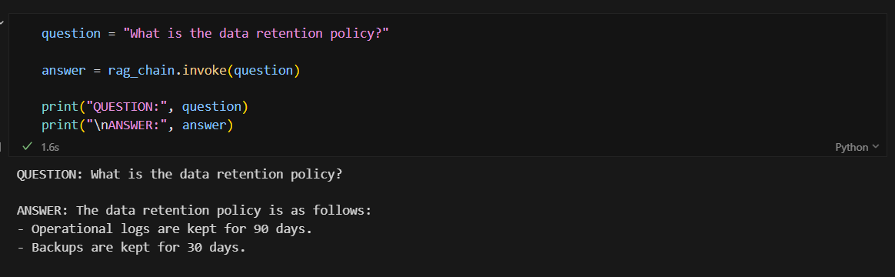
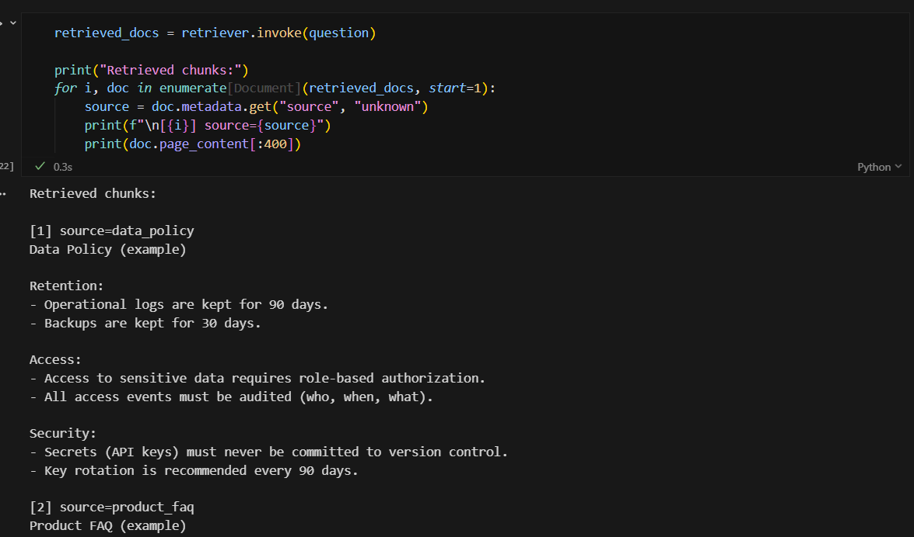
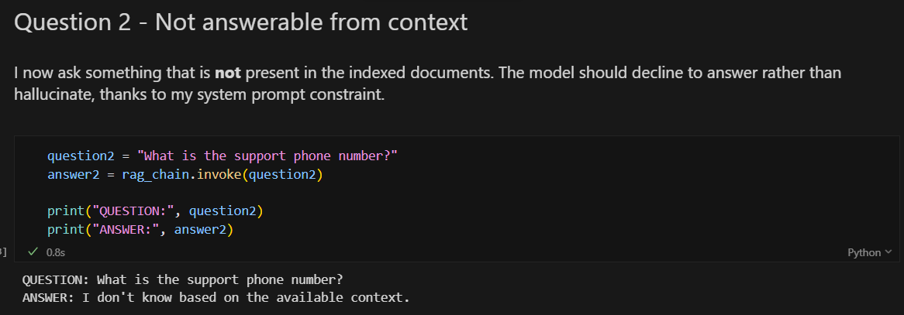

# Lab 5 - Introduction to RAGs with LangChain, Pinecone & Groq

## Overview

This repository contains my implementation of Lab 5: **Introduction to Creating Retrieval-Augmented Generators (RAGs)**. The lab covers two main objectives:

1. **Familiarize with LangChain and Pinecone** by following the official [Pinecone vector store integration tutorial](https://python.langchain.com/docs/integrations/vectorstores/pinecone).
2. **Build a complete RAG pipeline** following the [LangChain RAG tutorial](https://python.langchain.com/docs/tutorials/rag/), integrating document chunking, vector embeddings, semantic retrieval, and LLM-based answer generation.

> **Note on API providers:** The original lab instructions required using OpenAI for embeddings and the LLM. However, I was not able to use OpenAI because its API requires a paid plan (there is no free tier for programmatic usage). I also tried Google Gemini for both embeddings and LLM, but the free-tier generation quota for my Google Cloud project was consistently set to 0 (a known provisioning issue). In the end I chose the following free-tier stack that works reliably:
> - **Google Gemini** for embeddings (free tier works correctly).
> - **Groq** for the LLM (free tier: 30 requests/minute with Llama 3.3 70B).

---

## Repository Structure

```
.
├── 01_llm_chain_quickstart.ipynb   # Notebook 1: Pinecone integration tutorial
├── 02_rag_pinecone_openai.ipynb    # Notebook 2: Full RAG pipeline
├── img/                            
│   ├── rag1.png
│   ├── rag2.png
│   └── rag3.png
├── requirements.txt                # Python dependencies
├── .gitignore
└── README.md
```

---

## Notebooks

| Notebook | Tutorial implemented | What I do |
|----------|---------------------|-----------|
| `01_llm_chain_quickstart.ipynb` | [Pinecone integration](https://python.langchain.com/docs/integrations/vectorstores/pinecone) | I set up the vector store, add and delete documents, run similarity searches (with and without scores), and use the vector store as a LangChain Retriever. |
| `02_rag_pinecone_openai.ipynb` | [LangChain RAG tutorial](https://python.langchain.com/docs/tutorials/rag/) | I build a full RAG pipeline: define documents, split them into chunks, embed and upsert into Pinecone, build an LCEL chain with a retriever and an LLM, and query the chain with questions. |

---

## Architecture & Components

The RAG pipeline built follows this flow:

```
Documents  →  Chunking  →  Embedding  →  Pinecone (vector DB)
                                              ↓
User question  →  Retriever (top-k)  →  Context + Question  →  LLM  →  Answer
```

### Components

| Component | Technology | Details |
|-----------|-----------|---------|
| **Embeddings** | Google Gemini `gemini-embedding-001` | 768-dimensional vectors via Matryoshka Representation Learning (MRL).|
| **Vector Database** | Pinecone (serverless) | Cosine similarity metric. I use namespaces to isolate data between notebooks. Auto-detects and fixes dimension mismatches. |
| **LLM** | Groq `llama-3.3-70b-versatile` | Free tier (30 RPM).|
| **Framework** | LangChain (LCEL) | I compose the chain using `RunnablePassthrough`, `ChatPromptTemplate`, `StrOutputParser`. |
| **Text Splitter** | `RecursiveCharacterTextSplitter` | `chunk_size=800`, `chunk_overlap=120`. |

## Requirements

- **Python** 3.10 or higher
- **API keys** (all free):
  - [Google AI Studio](https://aistudio.google.com/apikey) → `GOOGLE_API_KEY` (for embeddings)
  - [Pinecone](https://app.pinecone.io/) → `PINECONE_API_KEY` (for vector storage)
  - [Groq Console](https://console.groq.com) → `GROQ_API_KEY` (for the LLM)

---

## Installation

1. **Clone the repository:**

```bash
git clone https://github.com/<your-username>/Lab-5-transformacion-digital.git
cd Lab-5-transformacion-digital
```

2. **Install dependencies:**

```bash
pip install -r requirements.txt
```

3. **Set up environment variables:**

Create a `.env` file in the project root:

```
GOOGLE_API_KEY=your-google-api-key
PINECONE_API_KEY=your-pinecone-api-key
GROQ_API_KEY=your-groq-api-key
```

```
PINECONE_INDEX_NAME=lab-rag-index
PINECONE_CLOUD=aws
PINECONE_REGION=us-east-1
```
---

## Running the Notebooks

Open Jupyter and run the notebooks **in order**:

1. **`01_llm_chain_quickstart.ipynb`** — Pinecone integration tutorial
   - Creates a Pinecone index, adds/deletes documents, and performs similarity searches.
   - Uses Google Gemini embeddings.

2. **`02_rag_pinecone_openai.ipynb`** — Full RAG pipeline
   - Loads credentials, creates the Pinecone index, prepares and chunks documents, embeds and upserts into Pinecone, builds the RAG chain with LCEL, and queries it.
   - Uses Google Gemini for embeddings and Groq (Llama 3.3) for the LLM.
---

## Screenshots — RAG in Action

### Answering a question from context



### Inspecting the retrieved sources



### Handling unanswerable questions


